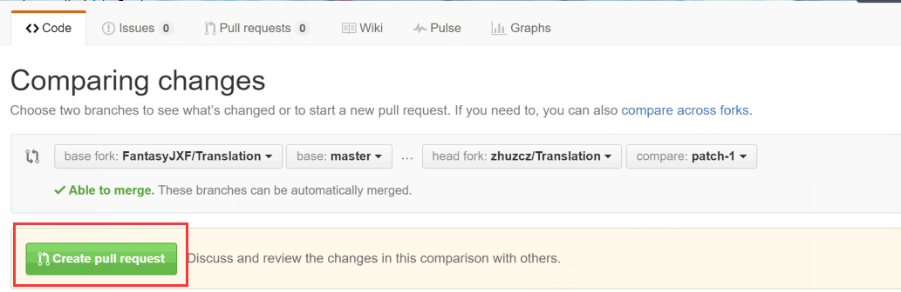
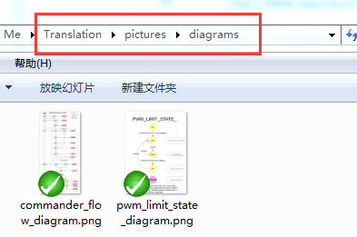

# # PX4中文维基

**敬启者：**

PX4开发者中文官网，翻译自http://dev.px4.io/

欢迎志同道合的伙伴共同努力。

---

**与官网不同，我们是中文，我们更全面，欢迎试用评论系统。**

---
---
* **GitBook **

与官网的方式相同，我们也是将网站以GitBook的方式呈现给大家。
Gitbook是一个命令行工具，可以把你的Markdown文件汇集成电子书，并提供PDF等多种格式输出。你可以把Gitbook生成的HTML发布出来，就形成了一个简单的静态网站，就像现在你所看到的。
用CSDN博客的相信大家都不会陌生Markdown这个工具。
不多说，[点进来][1]你就知道怎么使用了。
[1]: http://www.jianshu.com/p/21d355525bdf/comments/79044

* **Github**

这里我已经[将GitBook托管到了Github上][2]，大家感兴趣的可以fork下来一起完成这项工程谈不上浩大的工作，我想你也常常为打开官网望去满眼的英文而苦恼吧，来吧，我们可以做点什么的。fork地址在[这里][6].
[2]: http://www.jianshu.com/p/5d0b25cd9495
[6]: https://github.com/FantasyJXF/Translation.git

* **Git**

Git这个工具非常重要，且简单易学有意思，不妨掌握一下，技多不压身。关于Git的学习点我们的擎天柱[luoshi006][3],还有不得不说[廖雪峰的官方网站][4]也是极好的。
[3]: http://blog.csdn.net/luoshi006/article/details/51472123
[4]: http://www.liaoxuefeng.com/wiki/0013739516305929606dd18361248578c67b8067c8c017b000


最后还是诚邀志同道合的同志加入PX4中文维基的汉化组。
联系方式：<font face="Vijaya" size 10>  QQ群: 499861916</font> 


                                      <font face="Segoe Script" size 12>From Fantasy</font> 

 ---
####参与维护

1.         **网页端编辑**（<font color=#DC143C size=72>**强烈推荐**</font>：非常简单，只需三步就可以完成你的贡献）

           - 在浏览在线页面时进行编辑本页，这样，只要你看到不妥的地方立马可以修改，具体如下图

             

           - 或者也可以直接打开github中[网页端][8]进入要进行编辑的文件，如下图
[8]: https://github.com/FantasyJXF/Translation
  
​	  

    - 开始编辑：进入编辑页面后，对文件进行修改，会出现如下图问题


		按照提示，点击`Fork this repository and propose chanes`，进入即可编辑，如下图
 
​		

    - 提交贡献：首先提名文件更改，如下图

​    

    	检查是否与原有版本有冲突，如果有，解决冲突再提交，没有则提交，如下图


    	剩下来就是版主的事了，如果没有太大的问题，版主就可以合并分支了，到这你的对本文档的贡献就完成了。

1. 本地编辑（git高级用户推荐）

   相对于网页端编辑，本地编辑只是编辑在本地，后期的提交分支还是得在网页端进行，不过在此之前你得fork本项目到你的仓库。
   

   然后进行如下操作

   ```sh
   #下载你的项目到本地
   git clone https://github.com/FantasyJXF/Translation.git

   #进入文件夹进行编辑即可，完成后如下操作

   git add .
   #这里可以看到你的更改状况

   git status
   #添加你的更改备注，让别人知道你干了什么

   git commit -m "your comment"
   #提交更改

   git pull https://github.com/FantasyJXF/Translation.git master
   #检查是否与Fantasy云端产生冲突，如果有，解决冲突后重新git commit -m "your comment"

   git push origin master
   #推送到个人云端
   ```

2. 到这里为止，还只对你自己的仓库进行了修改，你需要`new pull request`提交分支到FantasyJXF的仓库，如下图，可以看出，如果只是少量的更改，建议使用网页端编辑。
   
   ​

   ### 注意看这里

   <font color=DC143C size=72>

   为了方便大家能够更好的参与进维护工作，现做了一些准备工作。</font>

   1. **分类**。文件对应到各自的文件夹。图片集中存放。

      

   2. **格式**。当大家打开需要翻译的文件的时候，格式已经与官网一致了！关于图片、视频、.md文件的链接、引用的超链接以及代码段已经设置完毕了，大家不用再去修改。只需要将相应部分的原文进行替换即可，保证大家<font color=#DC143C size=72>到手即翻</font>，什么基础都不需要就能够轻松完成贡献。

   3. **不足之处1**。不愿意将就，源于官网，异于官网。关于流程图格式的添加还未能掌握，还只能以截图形式展现，后期将会做处理，请大家将相应的图片存放于下图位置。

      

      添加方式为

      其中[括号内]的“diagram”是你对文件的描述，可为空。(括号内)表示文件所在的位置。这里我的README.md的位置在../pictures/introducing。可能大家可以找到别的方法添加，也可以。

   4. **不足之处2**。目前的PX4中文维基GitBook虽说大体与官网一致，但是字体之类感官上还有一点不同，这个不是主要矛盾，将在以后进行优化。GitBook上的视频都是Youtube上的，翻墙就能看到。关于翻墙工具，推荐Chrome浏览器 + [氪星人插件][12]

[11]: http://www.typora.io/
[10]: http://markdownpad.com/
[12]: http://pan.baidu.com/s/1dFx5O3n
####参考资料

1. 关于gitbook，可查看[www.gitbook.com](https://www.gitbook.com)。

2. gitbook的官方使用，可查看[https://help.gitbook.com](https://help.gitbook.com/)。


**在此感谢大家辛勤的劳动！**

